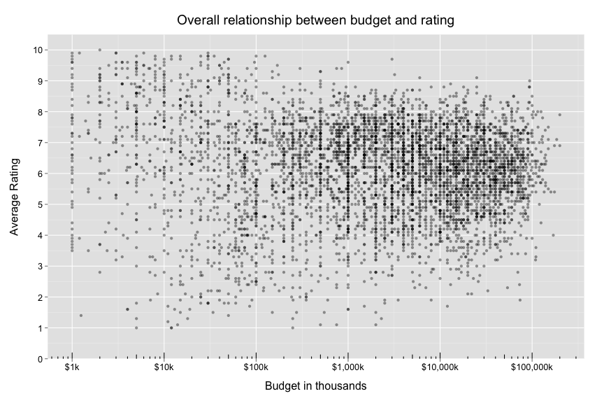
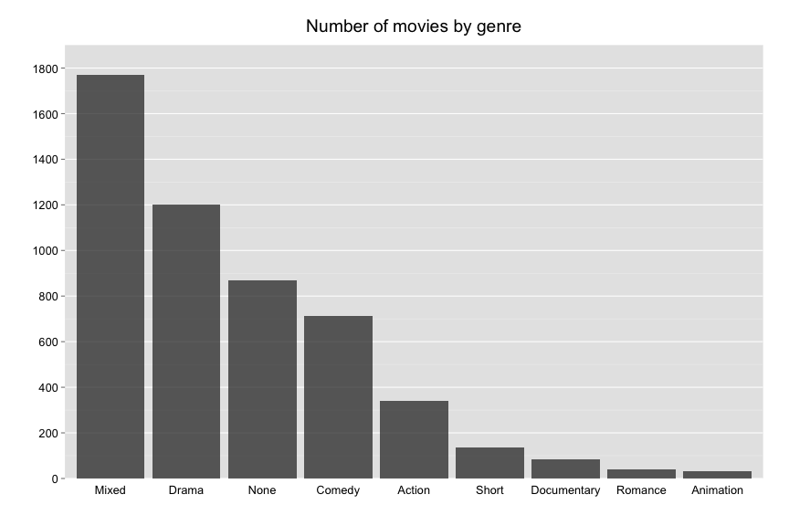
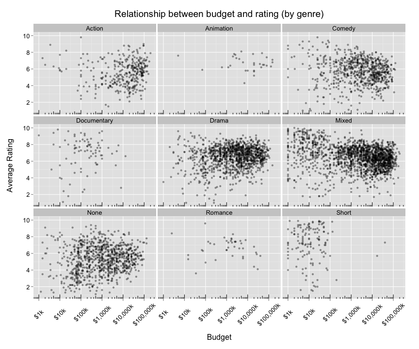
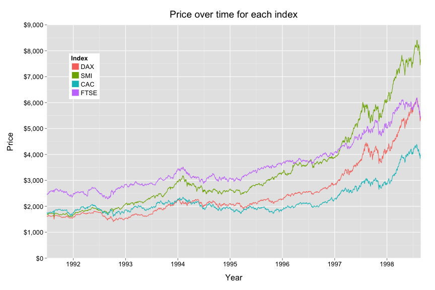

Homework 1: Basic Charts
========================

Configuration.


```r
library(knitr)
library(ggplot2)
library(scales)
library(grid)
library(reshape2)
opts_chunk$set(fig.width = 12, fig.height = 8, fig.align = "center", tidy = FALSE, 
    warning = FALSE)
custom <- theme(plot.margin = unit(c(1, 1, 1, 1), "cm"), title = element_text(vjust = 2), 
    axis.title.x = element_text(vjust = -1.25), axis.title.y = element_text(vjust = -0.1), 
    text = element_text(size = 14), strip.text = element_text(size = 16))
```


Load data and munge a bit.


```r
data(movies) 
data(EuStockMarkets)

movies <- subset(movies, budget > 0)

genre <- rep(NA, nrow(movies))
count <- rowSums(movies[, 18:24])
genre[which(count > 1)] = "Mixed"
genre[which(count < 1)] = "None"
genre[which(count == 1 & movies$Action == 1)] = "Action"
genre[which(count == 1 & movies$Animation == 1)] = "Animation"
genre[which(count == 1 & movies$Comedy == 1)] = "Comedy"
genre[which(count == 1 & movies$Drama == 1)] = "Drama"
genre[which(count == 1 & movies$Documentary == 1)] = "Documentary"
genre[which(count == 1 & movies$Romance == 1)] = "Romance"
genre[which(count == 1 & movies$Short == 1)] = "Short"
movies$genre <- factor(genre)

eu <- transform(data.frame(EuStockMarkets), time = time(EuStockMarkets))
```


## Question 1


```r
q1 <- ggplot(data = movies, 
       aes(x = budget,
           y = rating)) +
        geom_point(alpha=0.4) +
        ggtitle('Overall relationship between budget and rating') +
        xlab('Budget (dollars) on a log scale') +
        ylab('Average Rating') +
        scale_y_continuous(breaks=1:10) +
        scale_x_log10(labels=comma) +
        annotation_logticks(sides='b') +
        custom
print(q1)
```




## Question 2


```r
movies$genre <- with(movies, reorder(genre, genre, function(x) -length(x)))

ggplot(data = movies,
       aes(x = genre)) +
  geom_bar(alpha=0.75) +
  ggtitle('Number of movies by genre') +
  xlab('Genre') +
  ylab('Count') +
  custom
```




## Question 3

```r
(q1 + 
  facet_wrap(~ genre) + 
  scale_y_continuous(breaks=seq(0,10,2)) +
  ggtitle('Relationship between budget and rating (by genre)')) +
  xlab('Budget (dollars) on a log scale') + 
  ylab('Average Rating') + 
  custom
```

```
## Scale for 'y' is already present. Adding another scale for 'y', which will replace the existing scale.
```




## Question 4


```r
eu$time <- as.numeric(eu$time)
eu <- melt(eu,
           id.vars = 'time',
           variable.name = 'index',
           value.name = 'price')

ggplot(data = eu,
       aes(x = time, 
           y = price,
           group = index,
           colour = index)) +
  geom_line() +
  scale_x_continuous(breaks=c(1990:1999)) +
  ggtitle('Price over time for each index') +
  xlab('Year') +
  ylab('Price') +
  theme(legend.position = c(0.1, 0.78)) +
  custom
```



